# Jacky Motion

把中文口播稿变成可直接录屏的信息动画 HTML。

Jacky Motion 不是 PPT 模板，也不把全文做成大字幕。它先拆解口播的信息骨架，再用明确的视觉中心、画面重构、渐进揭示和记忆定格，让观众跟着口播节奏理解复杂内容。

<p align="center">
  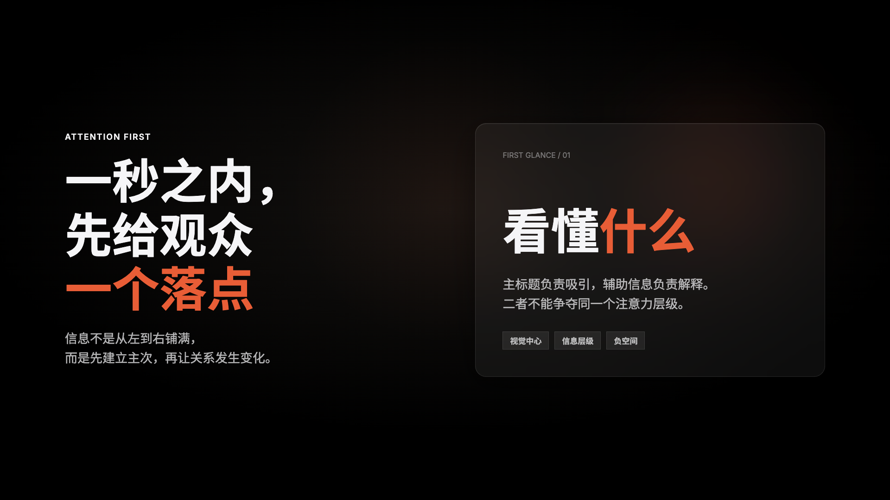
  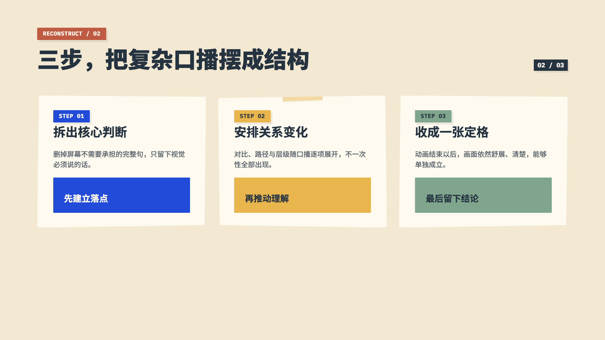
  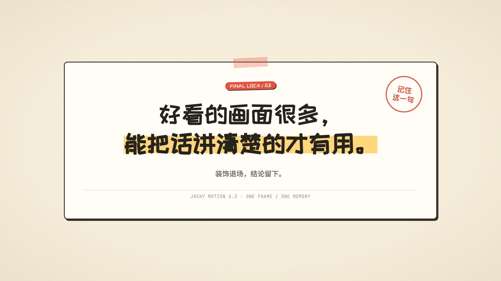
</p>

## 两种运行模式

同一个 Skill，在开始时按输入自动分流：

| 模式 | 你提供 | 生成结果 | 适合场景 |
|---|---|---|---|
| **纯 HTML** | 中文口播稿 | 手动推进的单文件 HTML，支持 16:9 与 3:4 | 边讲边录、自由掌握停顿、竖屏内容 |
| **HTML + SRT** | 口播稿 + 已校对 `.srt` | 按字幕时间自动播放的 16:9 HTML，含 B-roll 录屏画框 | 固定口播成片、严格同步、自动录屏 |

没有 SRT 时默认使用纯 HTML，不增加上手门槛。SRT 只作为时间主轴，不生成语音，也不会把字幕逐句铺到画面上。

## 核心能力

- **信息先行**：每个画面只讲一个核心关系，屏幕文字短于口播。
- **四段式镜头**：`glance → reconstruct → push → lock`，从第一眼落点走到最终记忆帧。
- **渐进揭示**：清单、流程和对比随口播逐步出现，不一次性堆满。
- **稳定排版**：禁止中心拥堵、单字孤行、重叠、溢出和引导线穿越内容。
- **双画幅**：纯 HTML 支持 1920×1080 横屏与 1080×1440 竖屏，竖版使用独立布局而非缩放。
- **自动录屏**：SRT 模式提供倒计时、暂停、跳转、重播和 B-roll 画框。
- **可验证交付**：静态校验 + 真实浏览器截图检查，不以“代码能打开”代替视觉验收。

## 七种风格实测

下面 21 张图全部使用当前 `2.2.1` 规则重新生成，并在 1920×1080 真实浏览器中验收，不复用历史版本截图。每种风格固定展示三种能力：

1. **开场落点**：第一眼能否立刻找到核心判断。
2. **关系重构**：流程、对比或层级能否舒展推进。
3. **最终定格**：动画停止后能否留下可独立截图的记忆帧。

### Apple Tech Gradient

**适合内容：** AI 工具、产品概念、抽象机制、发布会式观点。

**视觉语言：** 黑色空间、低强度暖光、SF 系无衬线与克制毛玻璃。热力橙只标记关键判断，留白用于建立聚光感，不把内容塞进卡片墙。

**表达强项：** 用尺度、远近和玻璃层级呈现抽象概念从模糊到清晰的过程。

<p align="center">
  
  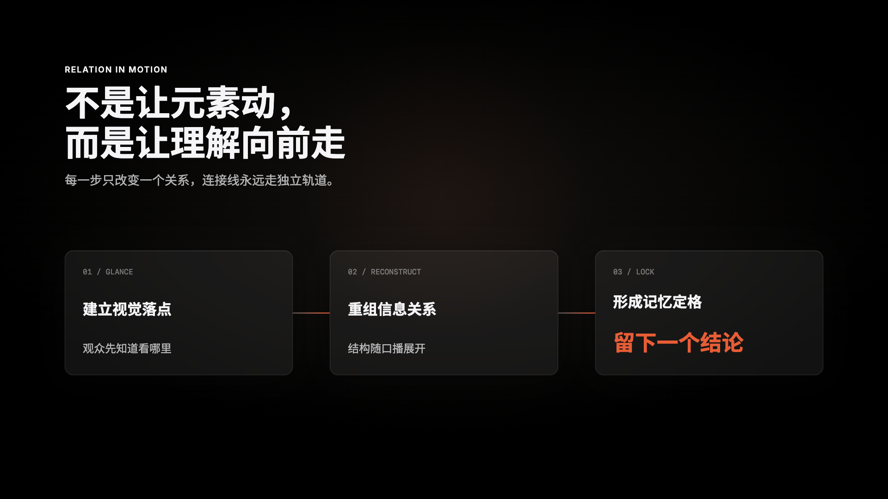
  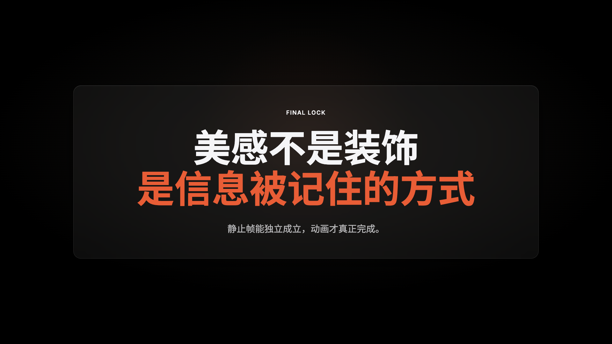
</p>
<p align="center"><sub>01 开场落点 · 大标题与主玻璃面板　　02 关系重构 · 三段理解路径　　03 最终定格 · 单一结论锁定</sub></p>

### Finance Studio Cards

**适合内容：** 财经解读、商业模式、公司分析、指标关系与风险判断。

**视觉语言：** 黑蓝演播室信息屏、等宽主数字、青绿传导路径；琥珀色只承担风险语义。主指标最亮，辅助指标主动退后。

**表达强项：** 先让观众看到主数字，再沿独立连接轨道理解数字背后的因果链。

<p align="center">
  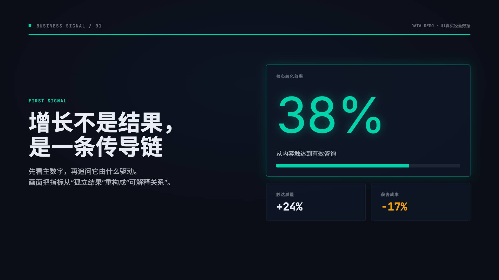
  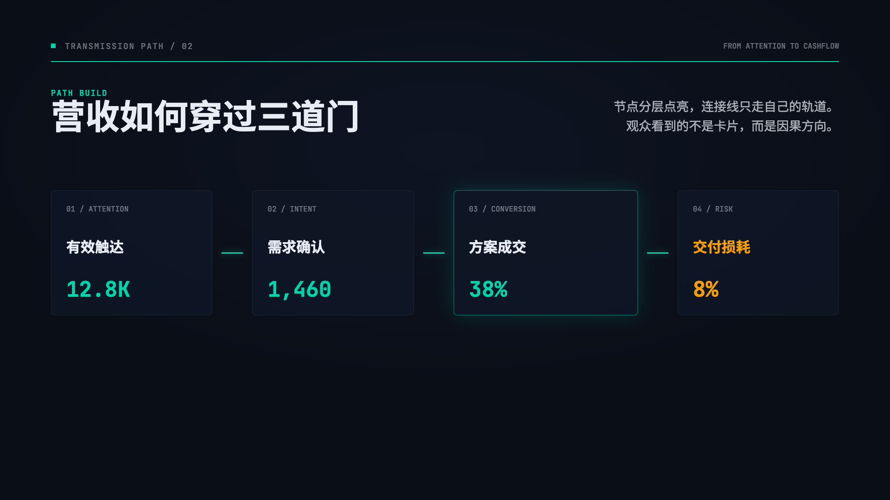
  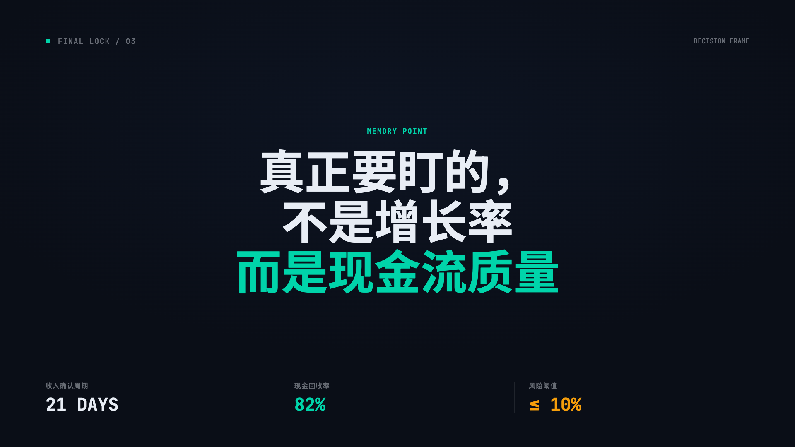
</p>
<p align="center"><sub>01 开场落点 · 主 KPI 与辅助指标　　02 关系重构 · 指标传导路径　　03 最终定格 · 决策结论与风险阈值</sub></p>

### Editorial Magazine

**适合内容：** 深度观点、文化观察、商业洞察与人物叙事。

**视觉语言：** 中文衬线标题、编辑红、巨型描边页码、拉引和规则线。版面像经过主编重排的杂志跨页，而不是普通图文卡片。

**表达强项：** 用标题、拉引和章节秩序控制阅读先后，让观点显得有重量但不拥挤。

<p align="center">
  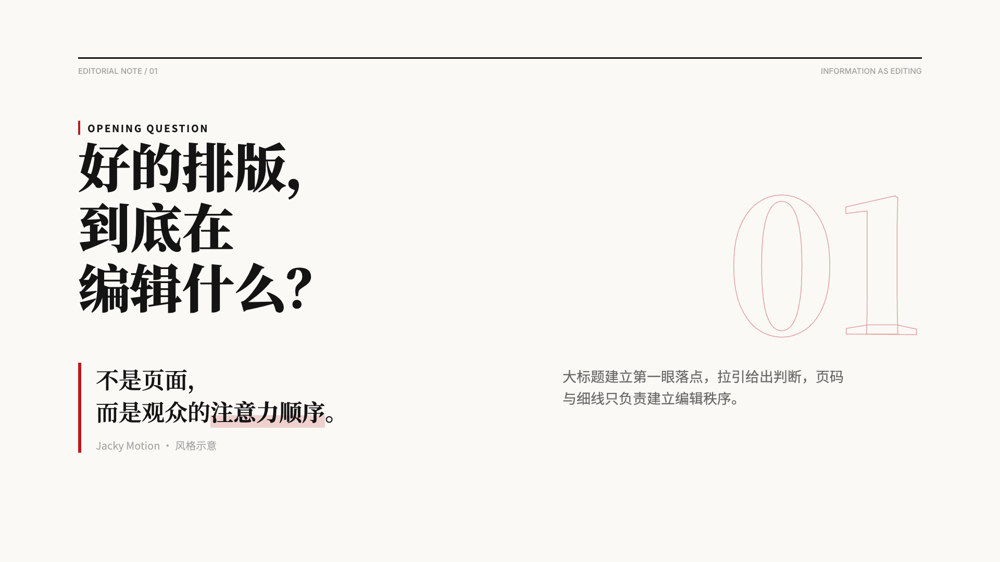
  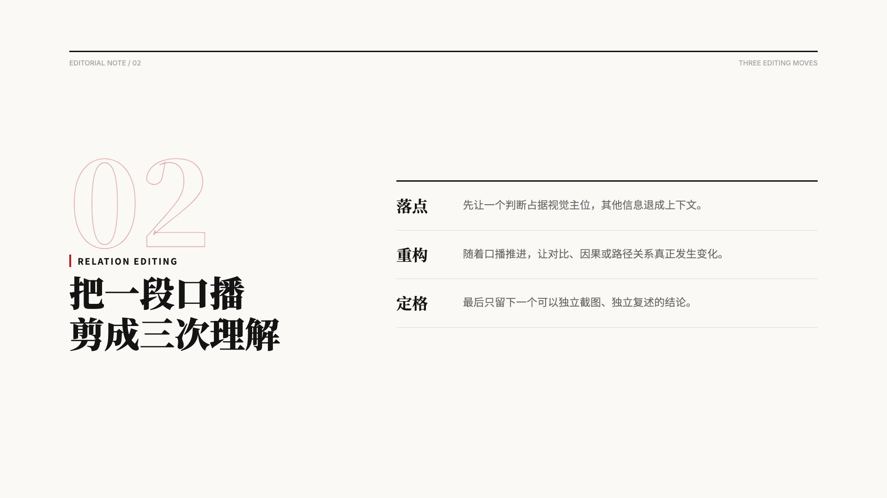
  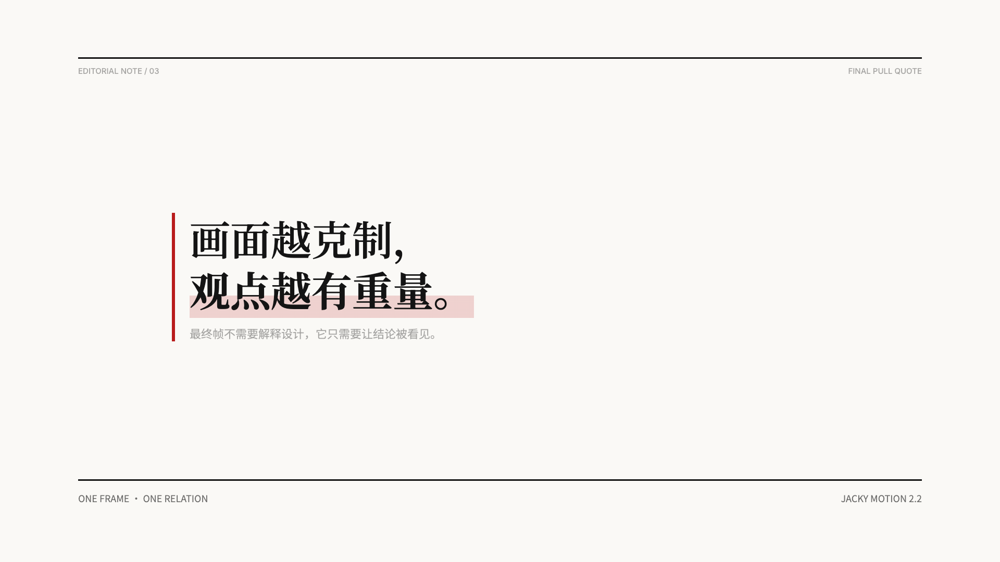
</p>
<p align="center"><sub>01 开场落点 · 标题与拉引　　02 关系重构 · 三条编辑规则　　03 最终定格 · 跨页式观点收束</sub></p>

### Newspaper Evidence

**适合内容：** 新闻事件、历史、政策、案例拆解、证据链和调查复盘。

**视觉语言：** 黑白米色纸面、衬线剪报、来源编号、胶带、短红线与结论印章。所有材料明确标注为真实来源或版式示意。

**表达强项：** 先呈现材料，再让批注贴合证据，最后盖章锁定有边界的结论。

<p align="center">
  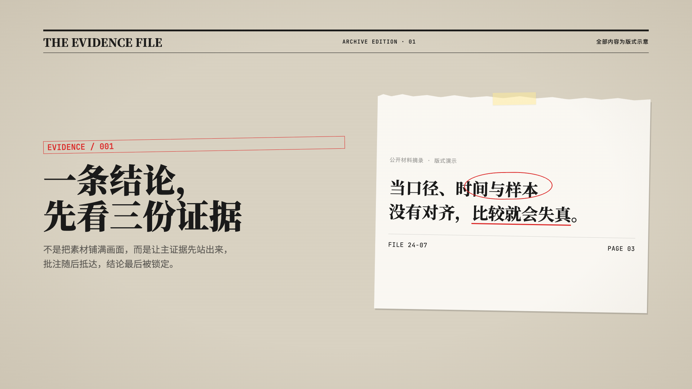
  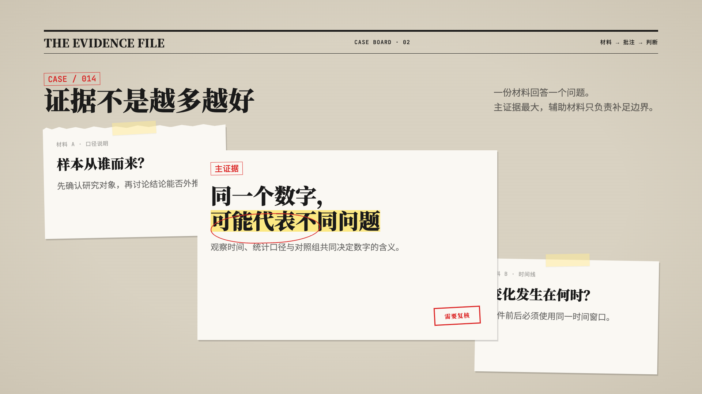
  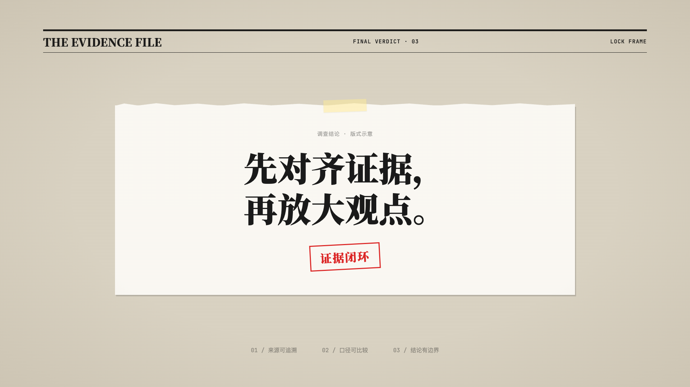
</p>
<p align="center"><sub>01 开场落点 · 主证据剪报　　02 关系重构 · 一主两辅证据板　　03 最终定格 · 调查结论盖章</sub></p>

### Paper Craft Studio

**适合内容：** 课程、教育解释、亲和品牌与友好型产品说明。

**视觉语言：** 暖纸工作台、奶油纸面、蓝黄绿模块和轻微错层。手作感来自纸张材质与裁边，不依赖幼稚插画或随意倾斜。

**表达强项：** 把复杂内容像整理纸片一样分层归位，特别适合步骤、系统和模块关系。

<p align="center">
  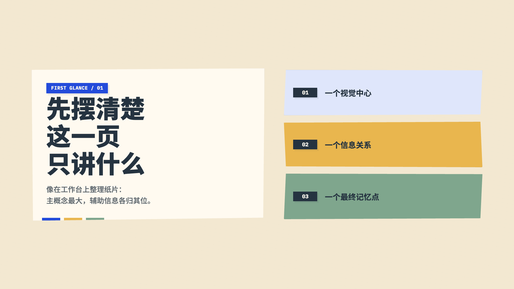
  
  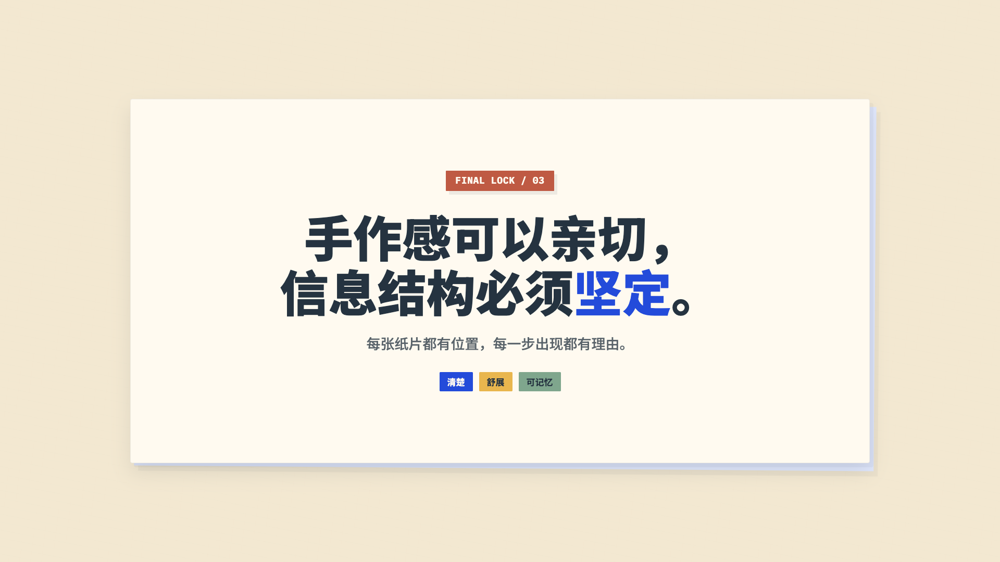
</p>
<p align="center"><sub>01 开场落点 · 主纸面与三层信息　　02 关系重构 · 三步模块展开　　03 最终定格 · 纸堆式结论收束</sub></p>

### Paper Collage

**适合内容：** 小红书、测评、经验清单、生活方式和种草内容。

**视觉语言：** 复古纸底、厚边贴纸、硬阴影、胶带、票据与马克笔。纸片可以有角度，但版面轴线和注意力顺序保持稳定。

**表达强项：** 在保持社交内容活力的同时，用贴纸层级完成问题、理由和行动方向的渐进揭示。

<p align="center">
  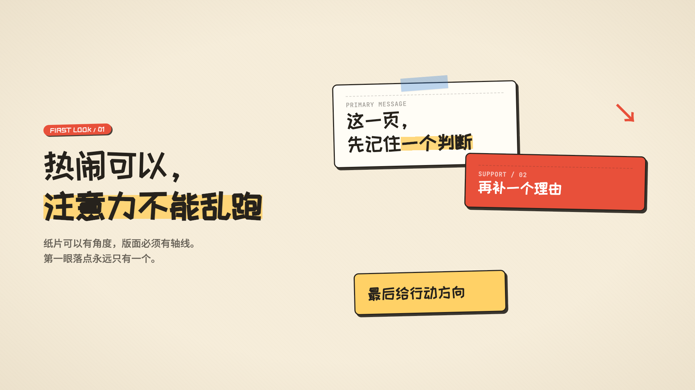
  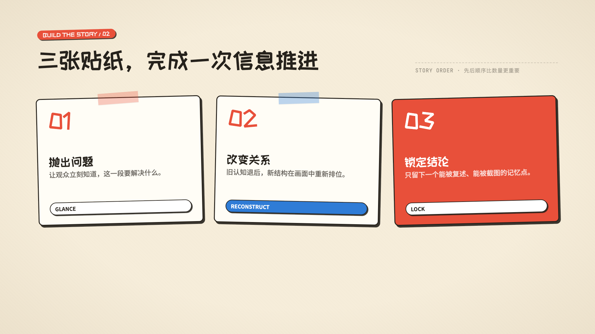
  
</p>
<p align="center"><sub>01 开场落点 · 主判断与辅助贴纸　　02 关系重构 · 三张叙事卡依次推进　　03 最终定格 · 马克笔观点锁定</sub></p>

### Sketch Note

**适合内容：** 教学、科普、教程、新手向方法讲解。

**视觉语言：** 白纸淡方格、楷体手写、墨线框、铅笔旁注和一支红笔。圈、线、箭头只用于解释，不作为无意义装饰。

**表达强项：** 像老师边讲边画，把抽象关系拆成可以跟随的线稿推演。

<p align="center">
  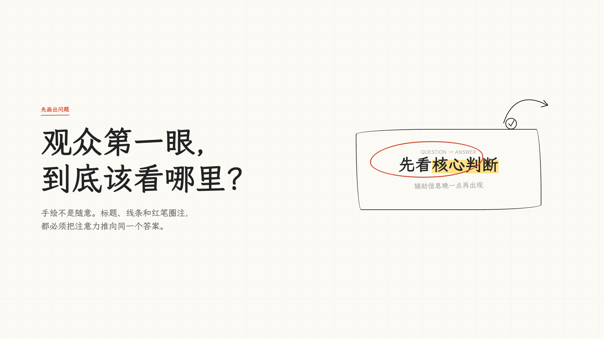
  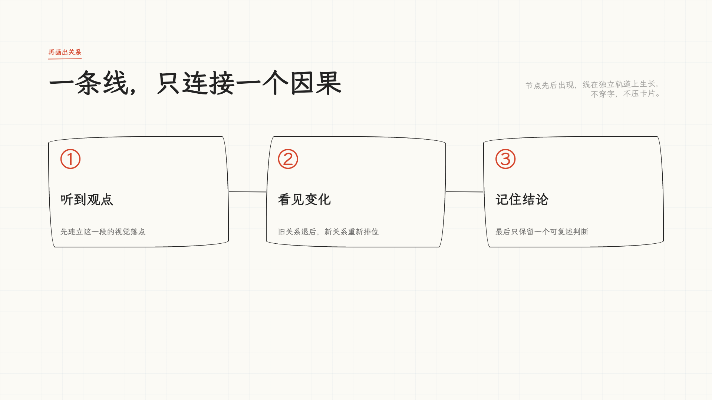
  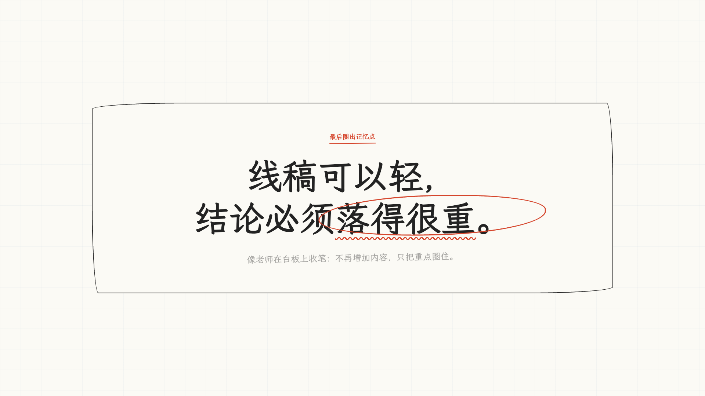
</p>
<p align="center"><sub>01 开场落点 · 红笔圈出核心判断　　02 关系重构 · 手绘因果链　　03 最终定格 · 波浪线与圈注收笔</sub></p>

全片只使用一个主风格。Skill 会根据内容给出风格选择表，并只推荐一个最合适的方向。

### SRT B-roll 录屏画框

当某一段更适合展示真实网站、产品或操作时，SRT 模式会生成带具体小标题的正式录屏窗口，而不是留一张空白制作备注。

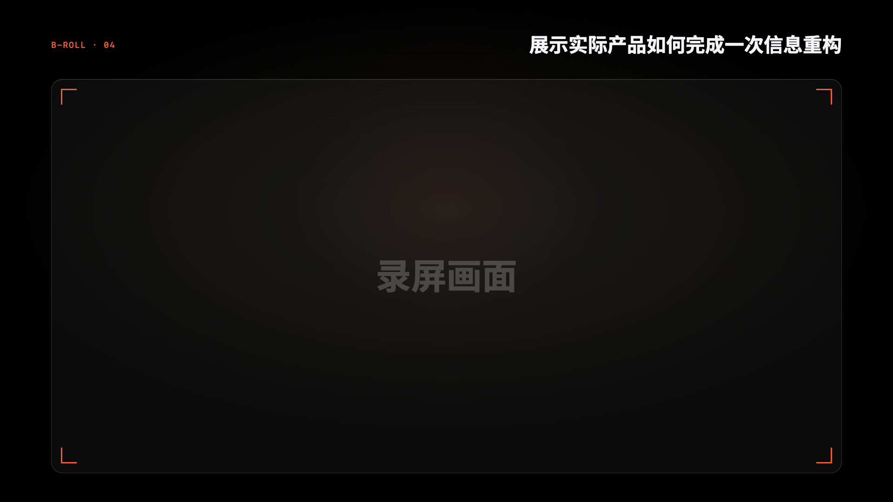

## 工作流

```text
选择模式
  → P1 审稿
  → P2 分镜
  → P3 锁风格与 Beat Contract
  → [SRT 模式追加 P3.5 时间轴确认]
  → P4 装配 HTML
  → P5 视觉与同步验收
```

审稿、分镜与风格阶段会停下来确认，把返工尽量留在写代码之前。

## 安装

使用通用 Skills 安装器：

```bash
npx skills add https://github.com/Jackywxsz/Jacky-motion
```

也可以直接从公开 GitHub 仓库导入到支持 Agent Skills 的应用。

## 使用示例

纯 HTML 横屏：

```text
使用 Jacky Motion，把这篇中文口播稿生成 16:9 可录屏信息动画 HTML。先审稿，按完整流程推进。
```

纯 HTML 竖屏：

```text
使用 Jacky Motion，把这篇口播稿生成 3:4 竖版信息动画。使用 paper-craft-studio 风格。
```

SRT 自动播放：

```text
使用 Jacky Motion，把这篇口播稿和已校对 SRT 生成 16:9 自动播放 HTML，并为真实产品展示区间安排 B-roll 录屏画框。
```

## 播放控制

**纯 HTML**

- 点击、`Space`、`→`：推进
- `←`：回退
- `R`：重播当前 Beat
- `F`：全屏

**SRT 自动播放**

- 点击“准备录屏”：请求全屏并倒数 3 秒
- `Space`：暂停 / 继续
- `←` / `→`：前后跳转 5 秒
- `R`：从头重播
- `F`：全屏

## 校验

纯 HTML：

```bash
node scripts/validate-motion-html.mjs path/to/output.html
node scripts/check-layout-browser.mjs path/to/output.html
```

SRT 自动播放：

```bash
node scripts/parse-srt.mjs path/to/input.srt
node scripts/validate-motion-html-srt.mjs path/to/output.html
node scripts/check-layout-browser-srt.mjs path/to/output.html
```

浏览器检查脚本会优先使用现有 Playwright；不可用时可改用 Agent 浏览器或人工截图，不要求用户为此单独搭建复杂环境。

## 仓库结构

```text
.
├── SKILL.md
├── agents/openai.yaml
├── assets/
│   ├── base-template.html
│   ├── base-template-portrait.html
│   ├── base-template-srt.html
│   └── styles/*.css
├── styles/*.md
├── references/
│   ├── 共享视觉、版式与动效规则
│   └── SRT 时间轴与验收增量
├── scripts/
│   ├── 纯 HTML 校验器
│   └── SRT 解析与校验器
└── docs/gallery/
```

## 边界

- 输出 HTML，不直接渲染 MP4。
- 不提供 TTS，不生成或嵌入音频。
- SRT 自动播放当前固定为 16:9；3:4 使用纯 HTML 模式。
- 真实数据、引用与截图由用户提供；Skill 不捏造来源。

## 反馈

欢迎通过 [GitHub Issues](https://github.com/Jackywxsz/Jacky-motion/issues) 提交问题与建议。

## License

[MIT](LICENSE)
