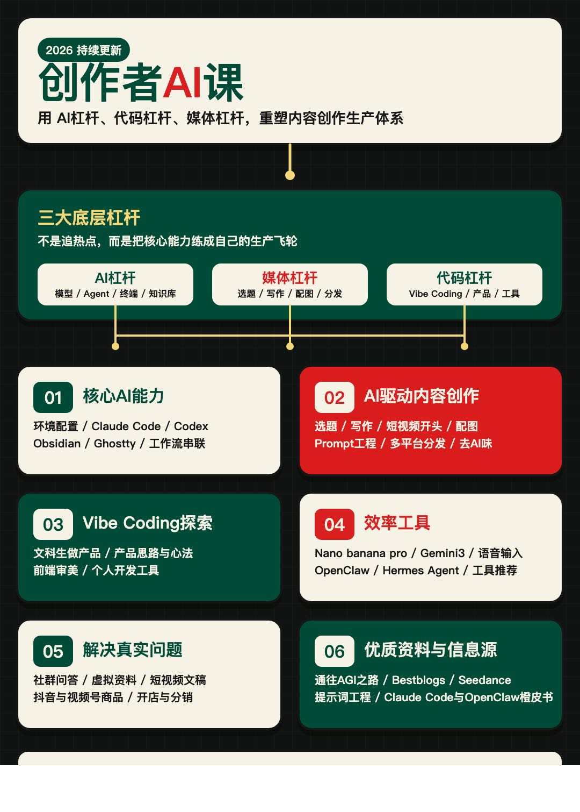

# Jacky Motion 2.0

把中文口播稿变成可录屏的 16:9 信息动画 HTML。

Jacky Motion 是一个面向中文内容创作者的 Agent Skill。它会先审稿、拆分镜、确认视觉风格，再装配成可点击推进的单文件 HTML，并通过静态校验和浏览器布局检查完成验收。

它不是 PPT 模板，也不直接输出 MP4。它更像一位“信息动画导演”：先判断观众这一秒应该看哪里、理解什么关系，再决定版式和动画怎么服务表达。

> 当前公开显示名为 **Jacky Motion 2.0**。`SKILL.md` 中的 **2.1 Hybrid** 是 2.0 的最新混合版架构标记，不是另一个独立 Skill。

## 这次升级了什么

- 从旧版 6 阶段调整为 **5 阶段、3 个确认门**：审稿 → 分镜 → 锁风格 → 装配 HTML → 视觉验收。
- 引入固定的运行时基座，生成时只装配内容、风格和时间线，降低交互失效与版本漂移。
- 默认重点风格从 4 个扩展到 **6 个**，新增 `paper-collage` 和 `sketch-note`。
- 增加 L01-L10 登记制版式骨架、信息原语、Beat Contract 和 Hybrid 质量门禁。
- 动效统一为 `glance → reconstruct → push → lock` 四段式镜头编排。
- 强制 final-state-first：静止态就是最终帧，动画结束后必须完全静止、可截图。
- 新增静态校验脚本和可选的 Playwright 浏览器布局检查。
- 移除 TTS / audio / voice 流程，专注于可录屏的信息动画 HTML。

## 适合谁

- AI 工具、产品机制和抽象概念讲解
- 教程、科普、新手向知识内容
- 商业分析、财经结构和指标关系
- 新闻、历史、案例与证据链
- 深度观点、文化与商业洞察
- 小红书、短视频清单、经验总结与种草内容

如果你的核心目标是“把一件事讲清楚”，Jacky Motion 会比套 PPT 模板更合适。

## 核心工作流

```text
口播稿
  ↓
P1 审稿：判断通过 / 轻改 / 重写
  ↓ 确认
P2 分镜：拆 Beat、信息原语、视觉动词和屏幕文字
  ↓ 确认
P3 锁风格：选择全片唯一风格，填写 Beat Contract
  ↓ 确认
P4 装配 HTML：固定基座 + 风格层 + 版式层 + 内容层 + 时间线层
  ↓
P5 视觉验收：静态校验 + 浏览器布局检查 + 关键帧截图
```

前三个阶段都会停下来等待确认。这样可以在写代码前先解决稿件、信息结构和审美方向的问题。

## 六个重点风格

| 风格 ID | 适合内容 | 画面气质 |
|---|---|---|
| `apple-tech-gradient` | AI 工具、产品概念、抽象机制 | 黑色空间里概念被光场托起 |
| `finance-studio-cards` | 财经、商业模式、指标关系 | 演播室信息屏，强调数字和传导路径 |
| `editorial-magazine` | 深度观点、文化商业洞察 | 正在重排的高级中文杂志跨页 |
| `newspaper-evidence` | 新闻、历史、案例、证据链 | 整理过的调查档案 |
| `paper-collage` | 清单、种草、经验总结、生活方式 | 新潮复古贴纸手账跨页 |
| `sketch-note` | 教学、科普、新手向讲解 | 白纸黑线知识手稿 |

仓库中还保留了 `apple-light-blue-glass`、`ink-framework` 和 `manifesto-poster` 的兼容资产，但它们不进入默认推荐和测试闭环。

## 安装

### 方式一：Skills 安装器

```bash
npx skills add https://github.com/Jackywxsz/jacky-motion
```

如果需要明确指定 Skill 和 Codex：

```bash
npx skills add https://github.com/Jackywxsz/jacky-motion --skill jacky-motion2-0 -a codex -g -y
```

### 方式二：手动安装

安装到你使用的 Agent Skills 目录。以 CC Switch 为例：

```bash
mkdir -p ~/.cc-switch/skills
git clone https://github.com/Jackywxsz/jacky-motion.git ~/.cc-switch/skills/jacky-motion2-0
```

更新现有安装：

```bash
git -C ~/.cc-switch/skills/jacky-motion2-0 pull
```

不同宿主读取 Skill 的目录和调用符号可能不同，请以当前宿主的 Skills 列表为准。

## 使用

在支持 Agent Skills 的环境里调用 `jacky-motion2-0`，贴入口播稿即可。

```text
使用 Jacky Motion 2.0，把下面这篇口播稿做成可录屏的 16:9 信息动画 HTML。先审稿，按完整流程推进。
```

如果已经确定风格，可以直接说明：

```text
使用 Jacky Motion 2.0，按 sketch-note 风格处理这篇教程口播稿。先审稿，不要跳过确认门。
```

如果没有指定风格，Skill 会根据内容给出风格选择表，并只推荐一个最适合的方向。

## 输出与控制

默认输出为单文件 HTML：

- 标准画幅：1920×1080，16:9
- 可选画幅：1440×1080，4:3
- 点击、`Space`、`→`：推进
- `←`：回退
- `R`：重播当前 Beat
- `F`：全屏

用浏览器打开 HTML，按 `F` 全屏后即可使用 QuickTime、OBS 或系统录屏工具录制。

## 质量规则

Jacky Motion 2.0 把“信息是否讲清楚”放在视觉装饰之前：

- 每个 Beat 只保留一个核心信息关系。
- 屏幕文字必须短于口播，不把整段稿子搬上屏幕。
- 每个 Beat 必须登记版式、信息原语和核心表达。
- 核心 Beat 必须使用四段式镜头编排，并在最后形成可独立截图的定格帧。
- 每个 Beat 最多 1 个结构运动、2 组辅助出现和 1 次锁定强调。
- 清单内容按口播节奏逐项揭示，不能一次性全部涌入。
- 验收以真实截图为准，出现重叠、溢出或裁切即视为失败。

完整规则见 [`SKILL.md`](SKILL.md) 和 [`references/`](references/)。

## 校验生成结果

静态校验：

```bash
node scripts/validate-motion-html.mjs path/to/output.html
```

本机已安装 Playwright 时，可继续运行浏览器布局检查：

```bash
node scripts/check-layout-browser.mjs path/to/output.html
```

浏览器检查不可用时，仍需用真实浏览器打开并检查首屏、信息最密 Beat、多步 Beat 最终帧和收束页。

## 仓库结构

```text
.
├── SKILL.md
├── agents/openai.yaml
├── assets/
│   ├── base-template.html
│   └── styles/*.css
├── styles/*.md
├── references/
│   ├── script-audit.md
│   ├── storyboard.md
│   ├── beat-contract.md
│   ├── hybrid-quality-gate.md
│   ├── information-primitives.md
│   ├── layout-skeletons.md
│   ├── motion-language.md
│   ├── html-production.md
│   └── quality-check.md
├── scripts/
│   ├── validate-motion-html.mjs
│   └── check-layout-browser.mjs
├── CHANGELOG.md
├── CONTRIBUTING.md
└── LICENSE
```

## 常见问题

### 它会直接生成视频吗？

不会。Jacky Motion 输出可交互、可录屏的 HTML，不直接渲染 MP4。

### 它会生成配音吗？

不会。2.0 已移除 TTS、audio 和 voice 相关流程，把重点放回信息动画本身。

### 为什么不能直接跳到 HTML？

因为脚本逻辑、信息结构或风格方向一旦没有锁定，后面的动画越复杂，返工成本越高。三个确认门用于在生成前解决这些关键问题。

### 可以混用多个风格吗？

不建议。单条内容只使用一个主风格；内容不适合当前风格时，应更换风格，而不是混搭。

## 反馈与共建

如果这个项目对你有帮助，欢迎给仓库一个 Star。使用中遇到问题、希望增加新的信息原语或版式，可以通过 [Issues](https://github.com/Jackywxsz/jacky-motion/issues) 提交反馈。

## 付费知识库与答疑群

<a href="https://mp.weixin.qq.com/s/x924y3O9-nWda5OTHArKKg">
  
</a>

我的付费知识库与答疑群欢迎加入：
[https://mp.weixin.qq.com/s/x924y3O9-nWda5OTHArKKg](https://mp.weixin.qq.com/s/x924y3O9-nWda5OTHArKKg)

## License

[MIT](LICENSE)
