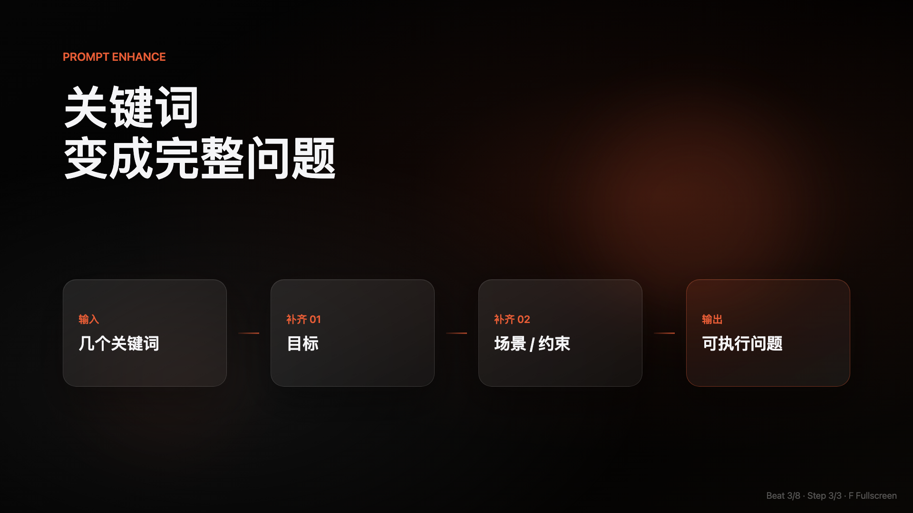
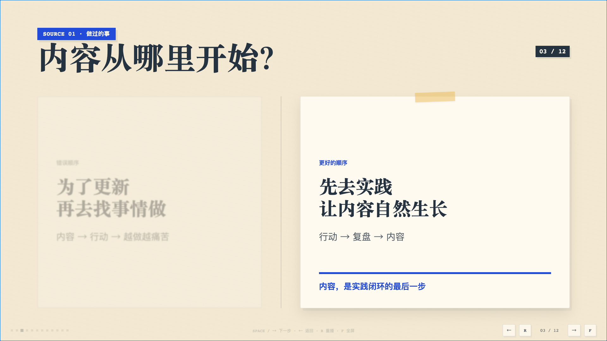
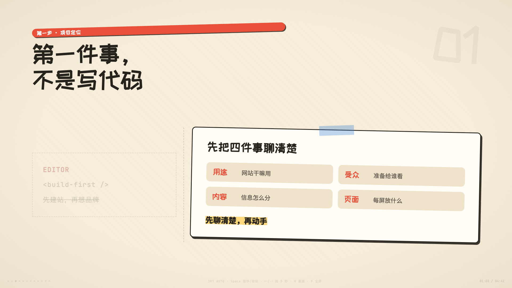
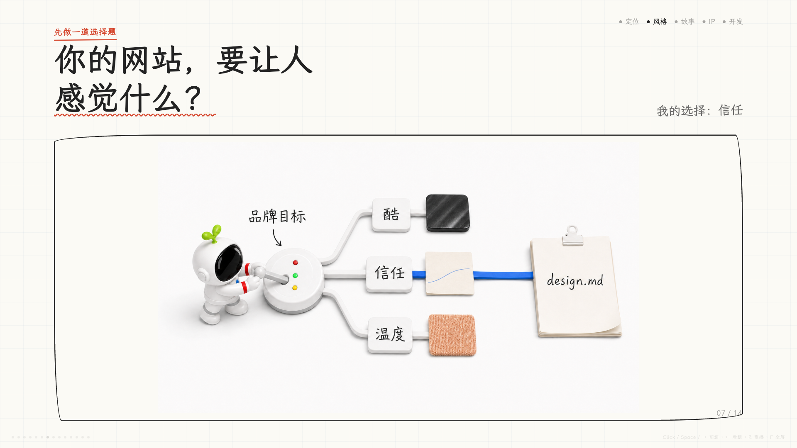
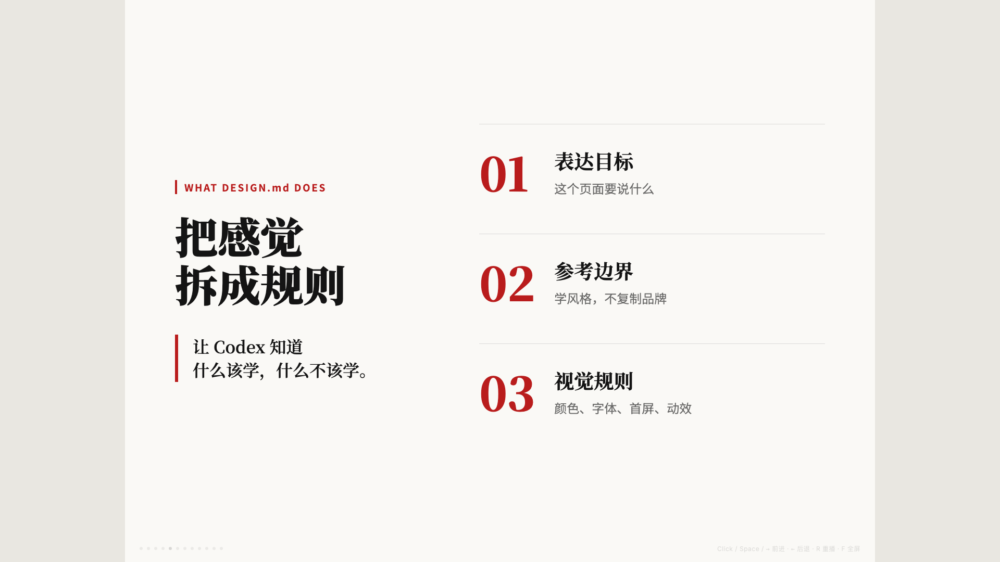

# Jacky Motion

把中文口播稿变成可直接录屏的信息动画 HTML。

Jacky Motion 不是 PPT 模板，也不把全文做成大字幕。它先拆解口播的信息骨架，再用明确的视觉中心、画面重构、渐进揭示和记忆定格，让观众跟着口播节奏理解复杂内容。

<p align="center">
  
  
</p>

## 两种运行模式

同一个 Skill，在开始时按输入自动分流：

| 模式 | 你提供 | 生成结果 | 适合场景 |
|---|---|---|---|
| **纯 HTML** | 中文口播稿 | 手动推进的单文件 HTML，支持 16:9 与 3:4 | 边讲边录、自由掌握停顿、竖屏内容 |
| **HTML + SRT** | 口播稿 + 已校对 `.srt` | 按字幕时间自动播放的 16:9 HTML，含 B-roll 录屏画框 | 固定口播成片、严格同步、自动录屏 |

没有 SRT 时默认使用纯 HTML，不增加上手门槛。SRT 只作为时间主轴，不生成语音，也不会把字幕逐句铺到画面上。

## 核心能力

- **信息先行**：每个画面只讲一个核心关系，屏幕文字短于口播。
- **四段式镜头**：`glance → reconstruct → push → lock`，从第一眼落点走到最终记忆帧。
- **渐进揭示**：清单、流程和对比随口播逐步出现，不一次性堆满。
- **稳定排版**：禁止中心拥堵、单字孤行、重叠、溢出和引导线穿越内容。
- **双画幅**：纯 HTML 支持 1920×1080 横屏与 1080×1440 竖屏，竖版使用独立布局而非缩放。
- **自动录屏**：SRT 模式提供倒计时、暂停、跳转、重播和 B-roll 画框。
- **可验证交付**：静态校验 + 真实浏览器截图检查，不以“代码能打开”代替视觉验收。

## 风格示意

以下均为 Jacky Motion 实际生成并经过浏览器验收的终帧。静态图展示排版与视觉语言，完整 HTML 还包含逐步推进和画面重构动画。

### Paper Craft Studio

适合课程、教育解释、亲和品牌与友好型产品说明。


### Paper Collage

适合小红书、测评、经验清单与生活方式内容。



### Sketch Note

适合科普、教程、新手向方法讲解。



### Editorial Magazine

适合深度观点、文化与商业洞察。



### Apple Tech Gradient

适合 AI 工具、产品概念与抽象机制。


### SRT B-roll 录屏画框

当某一段更适合展示真实网站、产品或操作时，SRT 模式会生成带具体小标题的正式录屏窗口。


## 七种重点风格

| 风格 ID | 适合内容 | 画面气质 |
|---|---|---|
| `apple-tech-gradient` | AI 工具、产品概念、抽象机制 | 黑色空间与聚光焦点 |
| `finance-studio-cards` | 财经、商业模式、指标关系 | 演播室数据屏与传导路径 |
| `editorial-magazine` | 深度观点、文化商业洞察 | 高级中文杂志跨页 |
| `newspaper-evidence` | 新闻、历史、案例、证据链 | 调查档案与证据编排 |
| `paper-craft-studio` | 课程、教育解释、亲和品牌 | 暖纸工作台与模块化纸片 |
| `paper-collage` | 清单、种草、经验总结 | 新潮复古贴纸手账 |
| `sketch-note` | 教学、科普、新手向讲解 | 白纸黑线知识手稿 |

全片只使用一个主风格。Skill 会根据内容给出风格选择表，并只推荐一个最合适的方向。

## 工作流

```text
选择模式
  → P1 审稿
  → P2 分镜
  → P3 锁风格与 Beat Contract
  → [SRT 模式追加 P3.5 时间轴确认]
  → P4 装配 HTML
  → P5 视觉与同步验收
```

审稿、分镜与风格阶段会停下来确认，把返工尽量留在写代码之前。

## 安装

使用通用 Skills 安装器：

```bash
npx skills add https://github.com/Jackywxsz/Jacky-motion
```

也可以直接从公开 GitHub 仓库导入到支持 Agent Skills 的应用。

## 使用示例

纯 HTML 横屏：

```text
使用 Jacky Motion，把这篇中文口播稿生成 16:9 可录屏信息动画 HTML。先审稿，按完整流程推进。
```

纯 HTML 竖屏：

```text
使用 Jacky Motion，把这篇口播稿生成 3:4 竖版信息动画。使用 paper-craft-studio 风格。
```

SRT 自动播放：

```text
使用 Jacky Motion，把这篇口播稿和已校对 SRT 生成 16:9 自动播放 HTML，并为真实产品展示区间安排 B-roll 录屏画框。
```

## 播放控制

**纯 HTML**

- 点击、`Space`、`→`：推进
- `←`：回退
- `R`：重播当前 Beat
- `F`：全屏

**SRT 自动播放**

- 点击“准备录屏”：请求全屏并倒数 3 秒
- `Space`：暂停 / 继续
- `←` / `→`：前后跳转 5 秒
- `R`：从头重播
- `F`：全屏

## 校验

纯 HTML：

```bash
node scripts/validate-motion-html.mjs path/to/output.html
node scripts/check-layout-browser.mjs path/to/output.html
```

SRT 自动播放：

```bash
node scripts/parse-srt.mjs path/to/input.srt
node scripts/validate-motion-html-srt.mjs path/to/output.html
node scripts/check-layout-browser-srt.mjs path/to/output.html
```

浏览器检查脚本会优先使用现有 Playwright；不可用时可改用 Agent 浏览器或人工截图，不要求用户为此单独搭建复杂环境。

## 仓库结构

```text
.
├── SKILL.md
├── agents/openai.yaml
├── assets/
│   ├── base-template.html
│   ├── base-template-portrait.html
│   ├── base-template-srt.html
│   └── styles/*.css
├── styles/*.md
├── references/
│   ├── 共享视觉、版式与动效规则
│   └── SRT 时间轴与验收增量
├── scripts/
│   ├── 纯 HTML 校验器
│   └── SRT 解析与校验器
└── docs/gallery/
```

## 边界

- 输出 HTML，不直接渲染 MP4。
- 不提供 TTS，不生成或嵌入音频。
- SRT 自动播放当前固定为 16:9；3:4 使用纯 HTML 模式。
- 真实数据、引用与截图由用户提供；Skill 不捏造来源。

## 反馈

欢迎通过 [GitHub Issues](https://github.com/Jackywxsz/Jacky-motion/issues) 提交问题与建议。

## License

[MIT](LICENSE)
